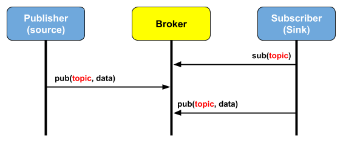
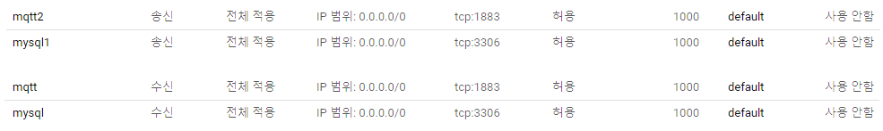

# 구글 클라우드 플랫폼 및 MQTT 설명

---

## 구글 클라우드 플랫폼

구글 클라우드 플랫폼에 리눅스 서버를 구축하였다.

### 접속 방법

ssh를 사용하여 접속할 수 있다. ras key는 rsa-gcp-key 파일을 사용한다.
rsa-gcp-key 파일이 있는 곳에서 터미널을 열고 다음의 쉘 명령어를 입력한다.

```shell script
ssh -i ./rsa-gcp-key shero@34.64.176.192
```

해당 명령어를 입력하면 rsa-key에 대한 비밀번호를 입력하라고 한다.
비밀번호는 'shero'이다.

---

## MQTT

MQTT는 IoT를 위한 통신 프로토콜로 저전력, 낮은 패킷량으로 통신한다는 점이 특징이다.
MQTT는 일반적인 통신과 다르게, 중간에 통신을 중계하는 브로커가 존재한다.



### 파이썬 사용 예시

#### 선행 조건

먼저 mqtt를 설치해야 한다.

```shell script
pip3 install paho-mqtt
```

#### 브로커에 연결

먼저 mqtt.client를 임포트한다.

```python
import paho.mqtt.client as client
```

mqtt 클라이언트를 만든다.

```python
mqtt_client = mqtt.Client()
```

브로커에 연결한다.

```python
mqtt_client.connect(host)
```

#### 브로커에 메세지 보내기

브로커에 연결 후, publish 메서드를 통해 메세지를 보낼 수 있다.
topic은 서로 같거나 상위의 topic에게 메세지가 전달된다.
예를 들면 abc/123 으로 메세지를 보내면 abc, abc/123 토픽을 구독하는 프로그램에게 메세지가 전달된다.
payload는 보낼 메세지이다.

```python
mqtt_client.publish(topic, payload)
```

#### 브로커로부터 메세지 받기

client 객체에 콜백 함수를 지정할 수 있다. 브로커와 연결에 성공하면 구독하는 콜백 함수를 지정한다.

```python
def on_connect(client, userdata, flags, rc):
    print(f"Connected with result code {str(rc)}")
    client.subscribe(topic)

mqtt_client.on_connect = on_connect()
```

브로커로부터 메세지를 받으면 호출되는 콜백 함수를 지정한다.

```python
def on_message(client, userdata, msg):
    print(f"{msg.topic} {str(msg.payload)}")

mqtt_client.on_message = on_message
```

---

## 문제 대응

### MQTT 및 MySQL 연결 실패 문제

MQTT 및 MySQL에 연결하는 것에 문제가 있었다. 방화벽이 문제였다.  

#### 해결 방법

각각 사용하는 포트에 대해 방화벽 설정을 바꾸어주었다. 우선 구글 클라우드 플랫폼 방화벽 설정을 해주었다.
구글 클라우드 플랫폼 Compute Engine 카테고리에서 방화벽 규칙 설정 페이지로 들어간다.
해당 페이지에서 '방화벽 규칙 만들기' 버튼을 눌러서 사용할 포트에 대해 송신, 수신 각각에 대해 허용 설정을 한다.



이제 리눅스 서버에서 방화벽 설정을 해주어야 한다. 다음 명령어로 방화벽 허용 설정을 할 수 있다.

```shell script
iptables -I INPUT 1 -p tcp -dport 1883 -j ACCEPT
iptables -I OUTPUT 1 -p tcp --dport 1883 -j ACCEPT
```