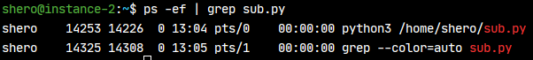

# 탄소배출량 실시간 산출 시스템

라즈베리파이에서 이산화탄소 배출량을 측정하여 구글 클라우드 플랫폼 서버로 MQTT 통신을 사용하여 보낸다.
서버에 있는 브로커(mosquitto)가 구독자 프로그램에게 해당 데이터를 전달하고, 
프로그램은 MySQL 데이터베이스에 데이터를 저장한다.
이 데이터베이스에 저장된 데이터들을 Grafana가 가져와 대시보드에 보여준다.

## 구글 클라우드 플랫폼

구글 클라우드 플랫폼에 리눅스 서버를 구축하였다.

### 접속 방법

ssh를 사용하여 접속할 수 있다. rsa key는 rsa-gcp-key 파일을 사용한다.
rsa-gcp-key 파일이 있는 곳에서 터미널을 열고 다음의 쉘 명령어를 입력한다.
외부 아이피는 34.74.238.233이다.

```shell script
ssh -i ./rsa-gcp-key shero@34.64.238.233
```

### 서버 상태

구글 클라우드 플랫폼의 리눅스 서버에 MySQL과 mosquitto, Grafana를 구축하였고,
백그라운드에 파이썬으로 작성된 구독자 프로그램을 실행 중이다.

#### MySQL

MySQL은 서버 내부에서 root로 접속할 수 있다.

```shell script
mysql -u root -p
```

서버 외부에서는 shero로 접속할 수 있다.

```shell script
mysql -h 34.64.238.233 -u shero -p
```

'sheroDB'라는 이름의 DB가 생성되어 있고, 그 안에 'co2_emissions'라는 이름의 테이블이 생성되어 있다.
해당 테이블의 열은 date_time, emissions로 2개이고, 각각 DATETIME, DOUBLE(7, 2) 타입을 갖는다.


#### Grafana

[그라파나 사이트](http://34.64.238.233:3000/) 링크를 통해 접속할 수 있다.
MySQL과 연동하여 데이터를 시각적으로 보여주고 있다.


#### 파이썬 구독자 프로그램

아래의 명령어로 백그라운드에 파이썬 구독자 프로그램을 실행할 수 있다.

```shell script
nohup python3 /home/shero/sub.py
```

이제 해당 터미널을 종료시켜도 프로그램은 계속 실행된다.
다른 터미널을 열어서 아래의 명령어로 백그라운드에서 실행 중인 구독자 프로그램을 확인할 수 있다.

```shell script
ps -ef | grep sub.py
```



종료시키려면 kill 명령어와 프로세스 아이디를 넘기면 된다.

```shell script
kill 14253
```

---

## MQTT

MQTT는 IoT를 위한 통신 프로토콜로 저전력, 낮은 패킷량으로 통신한다는 점이 특징이다.
MQTT는 일반적인 통신과 다르게, 중간에 통신을 중계하는 브로커가 존재한다.


### 파이썬 사용 예시

#### 선행 조건

먼저 mqtt를 설치해야 한다.

```shell script
pip3 install paho-mqtt
```

#### 브로커에 연결

먼저 mqtt.client를 임포트한다.

```python
import paho.mqtt.client as client
```

mqtt 클라이언트를 만든다.

```python
mqtt_client = mqtt.Client()
```

브로커에 연결한다.

```python
mqtt_client.connect(host)
```

#### 브로커에 메세지 보내기

브로커에 연결 후, publish 메서드를 통해 메세지를 보낼 수 있다.
topic은 서로 같거나 상위의 topic에게 메세지가 전달된다.
예를 들면 abc/123 으로 메세지를 보내면 abc, abc/123 토픽을 구독하는 프로그램에게 메세지가 전달된다.
payload는 보낼 메세지이다.

```python
mqtt_client.publish(topic, payload)
```

#### 브로커로부터 메세지 받기

client 객체에 콜백 함수를 지정할 수 있다. 브로커와 연결에 성공하면 구독하는 콜백 함수를 지정한다.

```python
def on_connect(client, userdata, flags, rc):
    print(f"Connected with result code {str(rc)}")
    client.subscribe(topic)

mqtt_client.on_connect = on_connect()
```

브로커로부터 메세지를 받으면 호출되는 콜백 함수를 지정한다.

```python
def on_message(client, userdata, msg):
    print(f"{msg.topic} {str(msg.payload)}")

mqtt_client.on_message = on_message
```

### MQTT를 이용해 구글 클라우드 플랫폼 리눅스 서버의 MySQL에 데이터 입력하기

pub.py에 작성된 함수를 보자. 해당 함수를 사용하여 배출량 데이터를 전송할 수 있다.

```python
def publish_to_server(date_time: str, emissions: float) -> None:
    """ 서버에 있는 브로커로 데이터를 발행한다.

    Args:
        date_time: 날짜와 시간 (format: YY-MM-DD hh:mm:ss)
        emissions: 배출량
    """
    payload = f"{date_time}|{str(emissions)}"
    mqtt_client = mqtt.Client("")
    mqtt_client.connect(host, port)
    mqtt_client.publish(topic, payload)
    mqtt_client.loop(2)
```

해당 함수를 이용해 현재 시간에 배출량 3500.00이라는 값을 데이터베이스로 전송해본다.
테스트 현재 시각은 2020-07-13 22:43:23 이다.

```python
now = datetime.now()
current_time_str = f"{now.year}-{now.month}-{now.day} {now.hour}:{now.minute}:{now.second}"
publish_to_server(current_time_str, 3500)
```

이제 MySQL에서 다음 쿼리문으로 확인한다.

```mysql
SELECT * FROM co2_emissions;
```

다음 캡처에서 성공적으로 전송된 것을 확인할 수 있다.


---

## 문제 대응

### MQTT 및 MySQL 연결 실패 문제

MQTT 및 MySQL에 연결하는 것에 문제가 있었다. 방화벽이 문제였다.  

#### 해결 방법

각각 사용하는 포트에 대해 방화벽 설정을 바꾸어주었다. 우선 구글 클라우드 플랫폼 방화벽 설정을 해주었다.
구글 클라우드 플랫폼 Compute Engine 카테고리에서 방화벽 규칙 설정 페이지로 들어간다.
해당 페이지에서 '방화벽 규칙 만들기' 버튼을 눌러서 사용할 포트에 대해 송신, 수신 각각에 대해 허용 설정을 한다.


이제 리눅스 서버에서 방화벽 설정을 해주어야 한다. 다음 명령어로 방화벽 허용 설정을 할 수 있다.

```shell script
iptables -I INPUT 1 -p tcp --dport 1883 -j ACCEPT
iptables -I OUTPUT 1 -p tcp --dport 1883 -j ACCEPT
```